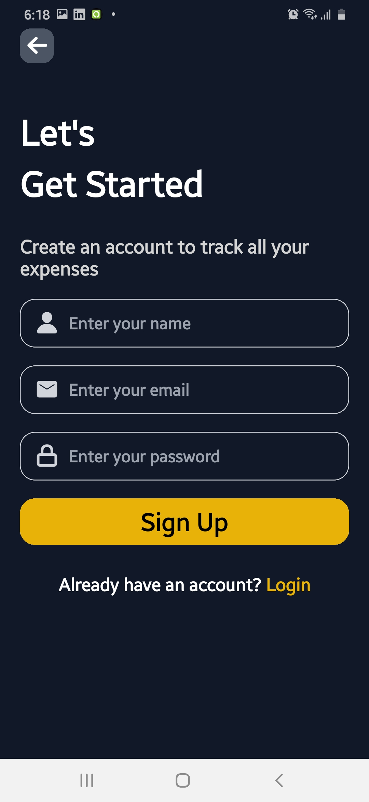
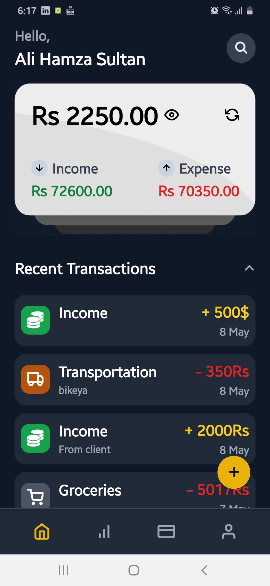

# 💰 Expense Tracker App

A simple and elegant **Expense Tracker** app built using **React Native** and **Expo**. Easily keep track of your daily expenses, view summaries, and stay on top of your budgeting goals — all from your mobile device.

## 📱 Screenshots

<div align="center">
  
  
  
</div>

## 🚀 Features

- ✅ Add new expenses with categories
- 📅 Filter expenses by date
- 📊 View total spending and income
- 🧭 Built using Expo and React Native
- 💾 Data stored locally (can be extended to use Firebase or a backend)

## 🛠️ Built With

- [React Native](https://reactnative.dev/)
- [Expo](https://expo.dev/)
- [React Navigation](https://reactnavigation.org/)
- [AsyncStorage](https://react-native-async-storage.github.io/async-storage/) – for local data storage

## ⚙️ Setup & Installation

1. Clone the repository:

   ```bash
   git clone https://github.com/yourusername/expense-tracker-app.git
   cd expense-tracker-app
